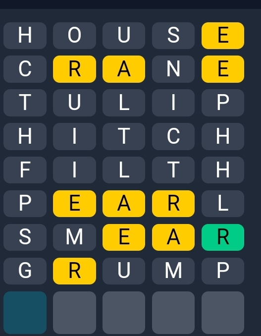

# Wordle helper helps you when your brain gives up on you. And you are not good with english.

Mention the must present letters in the list 'must_include'
Mention the must excluded letters in the list 'must_not_include'
Enter the known letter positions in 'letter_be_at'
Enter the known not to be present letters in 'letter_not_at'

An example is already shown in the program help.py

Run as:

# python help.py

Prints the list of all possible english words with given rules and restrictions applied.

---

Example:
Imagine you were stuck here:



It's too hard/risky to try and lose a game now. use this helper.

the data in `help.py` will be 
```
must_include = 'RAE'
must_not_include = 'HOUSCNTULIPHITCHFILTHPLSMGUMP'
letter_not_at = {
	'R': [2,4],
	'A': [3,4],
	'E': [2,3,5]
}
letter_be_at = {
	'R': [5]
}
```

Then do:
```
$ python help.py
BAKER
WAVER
```


Enjoy!